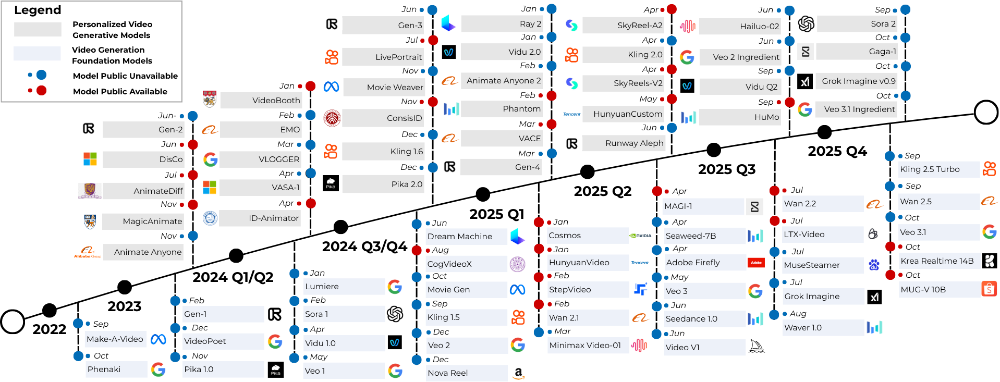

<div align=center>
 
</div>
<h2 align="center">
  <a href="">🔥 Awesome Personalized Video Creation</a>
</h2>
<p align="center">
  If you like our project, please give us a star ⭐ on GitHub for the latest update.
</p>
<p align="center">
  <a href="https://awesome.re">
    
  </a>
  <a href="https://github.com/inFaaa/Awesome-Personalized-Video-Creation/pulls">
    
  </a>
  
</p>

This repository is dedicated to collecting, organizing, and tracking recent advancements in personalized video generation and editing. It serves as a centralized resource for papers, models, and benchmarks in this rapidly evolving field.

<div align=center>

</div>

## Table
- [📣 Update News](#-update-news)
- [⚡ Contributing](#-contributing)
- [📚 Preliminaries](#-preliminaries)
  - [📽️ Video Generation Foundation Models](#️-video-generation-foundation-models)
    - [🌀 Diffusion Transformer](#-diffusion-transformer)
    - [🌀 U-Net](#-u-net)
    - [🌀 Autoregressive](#-autoregressive)
  - [🎛️ Multi-Modal Control Signal Tokenization](#️-multi-modal-control-signal-tokenization)
  - [🕳️ Control Paradigms in Video Generation](#️-control-paradigms-in-video-generation)
- [🌐 Open-Domain Personalized Video Generation Models](#-open-domain-personalized-video-generation-models)
  - [🎨 Subject-Driven Video Generation Models](#-subject-driven-video-generation-models)
  - [🎥 Motion-Driven Video Generation Models](#-motion-driven-video-generation-models)
  - [✂️ Personalized Video Editing Models](#️-personalized-video-editing-models)
  - [🔥 Look-Driven Video Generation Models](#-style-driven-video-generation-models)
- [🧑 Human-Domain Personalized Video Generation Models](#-human-domain-personalized-video-generation-models)
  - [🎨 Identity-Driven Video Generation Models](#-identity-driven-video-generation-models)
  - [🎺 Audio-Driven Portrait Animation](#-audio-driven-portrait-animation)
  - [🕺 Pose-Driven Human Animation](#-pose-driven-human-animation)
  - [🎨 Video-Driven Facial Reenactment](#-video-driven-facial-reenactment)
- [💼 Commercial Personalized Video Generation Models](#-commercial-personalized-video-generation-models)
- [📈 Datasets and Benchmarks](#-datasets-and-benchmarks)
  - [🌟 Personalized Video Generation Benchmarks](#-personalized-video-generation-benchmarks)
  - [📂 Personalized Video Generation Datasets](#-personalized-video-generation-datasets)
  - [📏 Key Evaluation Metrics](#-key-evaluation-metrics)
- [👍 Acknowledgement](#-acknowledgement)


## 📣 Update News

`[2024-07-18]` We have initiated the repository. 


## ⚡ Contributing

If you want to add your work to this list, please do not hesitate to email jhuang90@ur.rochester.edu or [pull requests]([https://github.com/inFaaa/Awesome-Personalized-Video-Generation/pulls](https://github.com/inFaaa/Awesome-Personalized-Video-Generation/pulls)).
Markdown format:

```markdown
* | [**Paper Title**] | Venue | Date | [[paper]](link) [[code]](link) [[project]](link)|
```

## 📚 Preliminaries

### 📽️ Video Generation Foundation Models
#### 🌀 Diffusion Transformer
- [Wan 2.1](https://github.com/Wan-Video/Wan2.1)
- [Step-Video](https://github.com/stepfun-ai/Step-Video-T2V)
- [HunyuanVideo](https://github.com/Tencent/HunyuanVideo)
- [LTX-Video](https://github.com/Lightricks/LTX-Video)
- [Mochi](https://github.com/genmoai/mochi)
- [CogVideo-X](https://github.com/THUDM/CogVideo)
- [Open-Sora-Plan](https://github.com/PKU-YuanGroup/Open-Sora-Plan)
- [Open-Sora](https://github.com/hpcaitech/Open-Sora)
- [Pyramid Flow](https://github.com/jy0205/Pyramid-Flow?tab=readme-ov-file)
- [Latte](https://github.com/Vchitect/Latte)
- [LongCat-Video](https://github.com/meituan-longcat/LongCat-Video)
- [Kandinsky 5.0](https://github.com/kandinskylab/kandinsky-5)
#### 🌀 U-Net
- [Stable Video Diffusion](https://github.com/Stability-AI/generative-models)
- [AnimateDiff](https://github.com/guoyww/AnimateDiff)
- [ModelScope](https://github.com/ali-vilab/VGen)
- [LVDM](https://github.com/yingqinghe/lvdm?tab=readme-ov-file)
#### 🌀 Autoregressive
- [Video-GPT](https://github.com/zhuangshaobin/Video-GPT)
- [MAGI-1](https://github.com/SandAI-org/MAGI-1)
- [Cosmos](https://arxiv.org/pdf/2511.00062)


### 🎛️ Multi-Modal Control Signal Tokenization
- [CLIP-Like](https://github.com/openai/CLIP)
- [VAE](https://github.com/huggingface/diffusers/tree/main/src/diffusers/models/autoencoders)
- [ArcFace-Like](https://github.com/deepinsight/insightface)
- [ControlNet-Like](https://github.com/lllyasviel/ControlNet)
- [T2I-Adapter-Like](https://github.com/TencentARC/T2I-Adapter)
- [SVD-Like](https://github.com/Stability-AI/generative-models)

### 🕳️ Control Paradigms in Video Generation
#### 📌 Structure-aware Control Modules
- [Controlnet](https://github.com/lllyasviel/ControlNet)
- [T2IAdapter](https://github.com/TencentARC/T2I-Adapter)
- AnyI2V: Animating Any Conditional Image with Motion Control, arXiv 2025, [Paper](https://arxiv.org/pdf/2507.02857)
#### 📌 Parameter-efficient Adaptation
- [LoRA](https://github.com/cloneofsimo/lora)
- [DreamBooth](https://dreambooth.github.io/)
#### 📌 Localized Editing
- [Inpainting](https://github.com/geekyutao/Inpaint-Anything)


## 🌐 Open-Domain Personalized Video Generation Models

### 🎨 Subject-Driven Video Generation Models

#### Test-time Fine-tuning

| Title                                                        | Venue     | Date             | Links                                                        |
| ------------------------------------------------------------ | --------- | ---------------- | ------------------------------------------------------------ |
| **PIA: Your Personalized Image Animator via Plug-and-Play Modules in Text-to-Image Models** | CVPR 2024 | Dec 2023 (arXiv) | [Paper](https://arxiv.org/abs/2312.13964v3) – [Project](https://pi-animator.github.io/)  - [Code](https://github.com/open-mmlab/PIA) |
| **VideoBooth: Diffusion-based Video Generation with Image Prompts** | CVPR 2024 | Dec 2023 (arXiv) | [Paper](https://arxiv.org/abs/2312.00777) – [Project](https://vchitect.github.io/VideoBooth-project/) – [Code](https://github.com/vchitect/VideoBooth) |
| **CustomVideo: Customizing Text-to-Video Generation with Multiple Subjects** | arXiv     | Jan 18 2024      | [Paper](https://arxiv.org/pdf/2401.09962) – [Project](https://kyfafyd.wang/projects/customvideo/) |
| **DisenStudio: Customized Multi-subject Text-to-Video Generation with Disentangled Spatial Control** | ACMMM 2024     | May 21 2024      | [Paper](https://mn.cs.tsinghua.edu.cn/xinwang/PDF/papers/2024_DisenStudio%20Customized%20Multi-Subject%20Text-to-Video%20Generation%20with%20Disentangled%20Spatial%20Control.pdf) – [Project](https://forchchch.github.io/disenstudio.github.io/) - [Code](https://github.com/forchchch/disenstudio.github.io) |
| **Still-Moving: Customized Video Generation without Customized Video Data** | TOG  | Jul 11 2024      | [Paper](https://arxiv.org/abs/2407.08674) – [Project](https://still-moving.github.io/) |
| **Customcrafter: Customized Video Generation with Preserving Motion and Concept Composition Abilities** | AAAI 2025    | Feb 2025         | [Paper](https://arxiv.org/abs/2408.13239) – [Code](https://github.com/WuTao-CS/CustomCrafter) |
| **Dynamic Concepts Personalization from Single Videos** | SIGGRAPH 2025 | Feb 20 2025      | [Paper](https://arxiv.org/pdf/2502.14844) – [Page](https://snap-research.github.io/dynamic_concepts/)|
| **BridgeIV: Bridging Customized Image and Video Generation through Test-Time Autoregressive Identity Propagation** | arXiv     | May 11 2025      | [Paper](https://arxiv.org/pdf/2505.06985)|

#### Pretrained Adaptation

| Title                                                        | Venue     | Date             | Links                                                        |
| ------------------------------------------------------------ | --------- | ---------------- | ------------------------------------------------------------ |
| **Movie Gen: A Cast of Media Foundation Models**             | arXiv     | Oct 17 2024      | [Paper](https://arxiv.org/abs/2410.13720) – [Project](https://ai.meta.com/research/movie-gen/) |
| **SUGAR: Subject-Driven Video Customization in a Zero-Shot Manner**             | arXiv     | Dec 13 2024      | [Paper](https://arxiv.org/pdf/2412.10533) – [Project](https://yufanzhou.com/SUGAR/) |
| **VideoMaker: Zero-shot Customized Video Generation with the Inherent Force of Video Diffusion Models** | arXiv     | Dec 27 2024      | [Paper](https://arxiv.org/abs/2412.19645) – [Code](https://github.com/WuTao-CS/VideoMaker) |
| **Multi-subject Open-set Personalization in Video Generation** | CVPR 2025 | Jan 2025 (arXiv) | [Paper](https://arxiv.org/abs/2501.06187) – [Project](https://snap-research.github.io/open-set-video-personalization/) – [Code](https://github.com/snap-research/open-set-video-personalization) |
| **ConceptMaster: Multi-Concept Video Customization on Diffusion Transformer Models Without Test-Time Tuning** | arXiv     | Jan 2025         | [Paper](https://arxiv.org/abs/2501.04698) |
| **AnyCharV: Bootstrap Controllable Character Video Generation with Fine-to-Coarse Guidance** | arXiv     | Feb 2025         | [Paper](https://arxiv.org/abs/2502.08189) – [Code](https://github.com/AnyCharV/AnyCharV) |
| **Movie Weaver: Tuning-Free Multi-Concept Video Personalization with Anchored Prompts** | CVPR 2025  | Feb 2025         | [Paper](https://arxiv.org/abs/2502.07802)                    |
| **Phantom: Subject-Consistent Video Generation via Cross-Modal Alignment** | ICCV 2025 | Feb 16 2025      | [Paper](https://arxiv.org/abs/2502.11079) – [Project](https://phantom-video.github.io/Phantom/) – [Code](https://github.com/Phantom-video/Phantom) |
| **SkyReels-A2: Compose Anything in Video Diffusion Transformers** | arXiv     | Apr 3 2025       | [Paper](https://arxiv.org/abs/2504.02436) – [Project](https://skyworkai.github.io/SkyReels-A2/) – [Code](https://github.com/SkyWorkAI/skyreels-a2) |
| **CINEMA: Coherent Multi-Subject Video Generation via MLLM-Based Guidance** | arXiv     | Mar 13 2025      | [Paper](https://arxiv.org/abs/2503.10391)                    |
| **MAGREF: Masked Guidance for Any-Reference Video Generation** | arXiv     | May 29 2025      | [Paper](https://arxiv.org/pdf/2505.23742) [Code](https://github.com/MAGREF-Video/MAGREF) |
| **Tora2: Motion and Appearance Customized DiffusionTransformer for Multi-Entity Video Generation** | arXiv     | Jul 08 2025 | [Paper](https://arxiv.org/pdf/2507.05963) |
| **BindWeave: Subject-Consistent Video Generation via Cross-Modal Integration** | arXiv     | Oct 1 2025      | [Paper](https://arxiv.org/abs/2510.00438) [Page](https://lzy-dot.github.io/BindWeave/) |
| **Kaleido: Open-Sourced Multi-Subject Reference Video Generation Model** | arXiv  | Oct 21 2025      | [Paper](https://arxiv.org/abs/2510.18573) [Code](https://github.com/CriliasMiller/Kaleido) |
| **First Frame Is the Place to Go for Video Content Customization** | arXiv  | Nov 19 2025      | [Paper](https://arxiv.org/pdf/2511.15700) [Code](https://github.com/zli12321/FFGO-Video-Customization) |


### 🎥 Motion-Driven Video Generation Models

| Title                                                        | Venue        | Date             | Links                                                        |
| ------------------------------------------------------------ | ------------ | ---------------- | ------------------------------------------------------------ |
| **Structure and Content-Guided Video Synthesis with Diffusion Models** | ICCV 2023 | Feb 2023     | [Paper](https://openaccess.thecvf.com/content/ICCV2023/papers/Esser_Structure_and_Content-Guided_Video_Synthesis_with_Diffusion_Models_ICCV_2023_paper.pdf) |
| **VideoComposer: Compositional Video Synthesis with Motion Controllability** | NeurIPS 2023 | Jun 2023 (arXiv) | [Paper](https://arxiv.org/pdf/2306.02018) – [Project](https://videocomposer.github.io/) - [Code](https://github.com/ali-vilab/videocomposer) |
| **DreamVideo: Composing Your Dream Videos with Customized Subject and Motion** | CVPR 2024    | Dec 2023 (arXiv) | [Paper](https://arxiv.org/abs/2312.04433) – [Project](https://dreamvideo-t2v.github.io/) - [Code](https://github.com/ali-vilab/VGen) |
| **Customize-A-Video: One-Shot Motion Customization of Text-to-Video Diffusion Models** | ECCV 2024     | Feb 2024         | [Paper](https://arxiv.org/abs/2402.14780) - [Project](https://ryx19th.github.io/customize-a-video/) - [Code](https://github.com/customize-a-video/customize-a-video) |
| **MotionBooth: Motion-Aware Customized Text-to-Video Generation** | NeurIPS 2024 (Spotlight)     | Jun 2024         | [Paper](https://arxiv.org/abs/2406.17758) - [Project](https://jianzongwu.github.io/projects/motionbooth/) - [Code](https://github.com/jianzongwu/MotionBooth) |
| **DreamVideo-2: Zero-Shot Subject-Driven Video Customization with Precise Motion Control** | arXiv   | Oct 17 2024      | [Paper](https://arxiv.org/abs/2410.13830) – [Page](https://dreamvideo2.github.io/#) |
| **MoTrans: Customized Motion Transfer with Text-driven Video Diffusion Models** | ACMMM 2024        | Dec 2 2024      | [Paper](https://arxiv.org/abs/2412.01343) – [Code](https://github.com/XiaominLi1997/MoTrans) |
| **Subject-driven Video Generation via Disentangled Identity and Motion** | arXiv        | Apr 23 2025      | [Paper](https://arxiv.org/abs/2504.17816) – [Code](https://github.com/carpedkm/disentangled-subject-to-vid) |
| **DualReal: Adaptive Joint Training for Lossless Identity-Motion Fusion in Video Customization** | arXiv        | Mar 4 2025       | [Paper](https://arxiv.org/abs/2505.02192) – [Project](https://wenc-k.github.io/dualreal/) |
| **VideoMage: Multi-Subject and Motion Customization of Text-to-Video Diffusion Models** | CVPR 2025 | Mar 13 2025      | [Paper](https://arxiv.org/abs/2503.21781) [Project](https://jasper0314-huang.github.io/videomage-customization/) |
| **DreamRunner: Fine-Grained Compositional Story-to-Video Generation with Retrieval-Augmented Motion Adaptation** | Arxiv | Mar 18 2025      | [Paper](https://arxiv.org/pdf/2411.16657) - [Project](https://zunwang1.github.io/DreamRunner) - [Code](https://github.com/wz0919/DreamRunner) |
| **JointTuner: Appearance-Motion Adaptive Joint Training for Customized Video Generation** | arXiv        | Mar 31 2025      | [Paper](https://arxiv.org/abs/2503.23951) – [Project](https://fdchen24.github.io/JointTuner-Website/) |
| **PolyVivid: Vivid Multi-Subject Video Generation with Cross-Modal Interaction and Enhancement** | arXiv        | Jun 9 2025       | [Paper](https://sjtuplayer.github.io/projects/PolyVivid/)|
| **CoMo: Compositional Motion Customization for Text-to-Video Generation** | arXiv        | Oct 27 2025       | [Paper](https://arxiv.org/pdf/2510.23007) - [Page](https://como6.github.io)|
| **MotionStream: Real-Time Video Generation with Interactive Motion Controls** | arXiv        | Nov 03 2025       | [Paper](https://arxiv.org/abs/2511.01266) - [Page](https://joonghyuk.com/motionstream-web/) - [https://github.com/alex4727/motionstream]|


### ✂️ Personalized Video Editing Models

| Title                                                        | Venue     | Date         | Links                                                        |
| ------------------------------------------------------------ | --------- | ------------ | ------------------------------------------------------------ |
| **Tune-A-Video: One-Shot Tuning of Image Diffusion Models for Text-to-Video Generation** | ICCV 2023 | Dec 22 2022  | [Code](https://github.com/showlab/Tune-A-Video) <br> [Paper](https://arxiv.org/abs/2212.11565) |
| **Dreamix: Video Diffusion Models are General Video Editors** | arXiv     | Feb 2023     | [Paper](https://arxiv.org/abs/2302.01329) – [Project](https://dreamix-video-editing.github.io/) |
| **Make-A-Protagonist: Generic Video Editing with Visual and Textual Clues** | arXiv     | May 15  2023 | [Paper](https://arxiv.org/pdf/2305.08850) – [Code](https://github.com/HeliosZhao/Make-A-Protagonist) |
| **Towards Consistent Video Editing with Text-to-Image Diffusion Models**      | NeurIPS 2023 | May 27 2023 | [Paper](https://arxiv.org/abs/2305.17431)  |
| **Make-Your-Video: Customized Video Generation Using Textual and Structural Guidance** | TVCG 2024 | Jun 2023 | [Paper](https://arxiv.org/abs/2306.00943) – [Code](https://github.com/AILab-CVC/Make-Your-Video) |
| **MagicEdit: High-Fidelity and Temporally Coherent Video Editing** | arXiv     | Aug 28 2023  | [Paper](https://arxiv.org/abs/2308.14749) – [Code](https://github.com/magic-research/magic-edit) - [Page](https://magic-edit.github.io/) |
| **Cut-and-Paste: Subject-Driven Video Editing with Attention Control** | arXiv     | Nov 20 2023  | [Paper](https://arxiv.org/abs/2311.11697) – [Code](https://github.com/ZrrSkywalker/Cut-And-Paste) |
| **DragVideo: Interactive Drag-style Video Editing**      | ECCV 2024 | Dec 3 2023 | [Paper](https://arxiv.org/abs/2312.02216) - [Code](https://github.com/RickySkywalker/DragVideo-Official) |
| **AnyV2V: A Tuning-Free Framework For Any Video-to-Video Editing Tasks**       | TMLR 2024     | Mar 21 2024   | [Paper](https://arxiv.org/abs/2403.14468) – [Project](https://tiger-ai-lab.github.io/AnyV2V/) – [Code](https://github.com/TIGER-AI-Lab/AnyV2V) |
| **ReVideo: Remake a Video with Motion and Content Control** | NeurIPS 2024   | May 22 2024         | — <br> [Paper](https://arxiv.org/abs/2405.13865) - [Project](https://mc-e.github.io/project/ReVideo/) - [Code](https://github.com/MC-E/ReVideo) |
| **DIVE: Taming DINO for Subject-Driven Video Editing**       | arXiv     | Dec 4 2024   | [Paper](https://arxiv.org/abs/2412.03347) – [Project](https://dino-video-editing.github.io)  |
| **DreamInsert: Zero-Shot Image-to-Video Object Insertion from A Single Image** | arXiv     | Mar 13 2025     | [Paper](https://arxiv.org/pdf/2503.10342)  |
| **Get In Video: Add Anything You Want to the Video** | arXiv | May 2025 | [Project](https://dreamix-video-editing.github.io/) – [Paper](https://arxiv.org/abs/2503.06268) |
| **Pix2Video: Video Editing using Image Diffusion** | ICCV 2023 | Mar 22 2023 | [Project](https://duyguceylan.github.io/pix2video.github.io/) – [Paper](https://arxiv.org/pdf/2303.12688) |
| **VideoAnydoor: High-fidelity Video Object Insertion with Precise Motion Control** | arXiv | Mar 28 2025 | [Project](https://videoanydoor.github.io/) – [Paper](https://arxiv.org/pdf/2501.01427) |
| **Lucy Edit: Open-Weight Text-Guided Video Editing** | arXiv | Sep 18 2025 | [Paper](https://d2drjpuinn46lb.cloudfront.net/Lucy_Edit__High_Fidelity_Text_Guided_Video_Editing.pdf) - [Github](https://github.com/DecartAI/Lucy-Edit-ComfyUI) |
| **OmniInsert: Mask-Free Video Insertion of Any Reference via Diffusion Transformer Models** | arXiv | Sep 22 2025| [Paper](https://arxiv.org/pdf/2509.17627) - [Project](https://phantom-video.github.io/OmniInsert/) - [Code](https://github.com/Phantom-video/OmniInsert)|
| **ContextFlow: Training-Free Video Object Editing via Adaptive Context Enrichment** | arXiv | Sep 22 2025|[Paper](https://arxiv.org/pdf/2509.17818) - [Project](https://yychen233.github.io/ContextFlow-page/) - [Code](https://github.com/yyChen233/ContextFlow)|
| **EditVerse: Unifying Image and Video Editing and Generation with In-Context Learning** | arXiv | Sep 24 2025|[Paper](https://arxiv.org/pdf/2509.20360) |
| **IMAGEdit : Let Any Subject Transform** | arXiv | Oct 01 2025| [Paper](https://arxiv.org/pdf/2510.01186) - [Project](https://muzishen.github.io/IMAGEdit/) - [Code](https://github.com/XWH-A/IMAGEdit)|
| **InstructX: Towards Unified Visual Editing with MLLM Guidance** | arXiv | Oct 10 2025|[Paper](https://arxiv.org/pdf/2510.08485) |
| **In-Context Learning with Unpaired Clips for Instruction-based Video Editing** | arXiv | Oct 16 2025| [Paper](https://arxiv.org/pdb/2510.14648) - [Code](https://github.com/leoisufa/ICVE?tab=readme-ov-file)|

### 🔥 Look-Driven Video Generation Models

Look: The unified visual baseline of a piece—covering style, color, and lighting, texture/grade, and any VFX choices, to achieve a consistent on-screen feel.

| Title                                                        | Venue        | Date        | Links                                                        |
| ------------------------------------------------------------ | ------------ | ----------- | ------------------------------------------------------------ |
| **VFXMaster: Unlocking Dynamic Visual Effect Generation via In-Context Learning** | arXiv | Oct 29 2025 | [Paper](https://arxiv.org/pdf/2510.25772) – [Project](https://libaolu312.github.io/VFXMaster/) – [Code](https://github.com/libaolu312/VFXMaster) |
| **Video-As-Prompt: Unified Semantic Control for Video Generation** | arXiv | Oct 28 2025 | [Paper](https://arxiv.org/pdf/2510.20888) – [Project](https://bytedance.github.io/Video-As-Prompt/) – [Code](https://github.com/bytedance/Video-As-Prompt) |
| **Omni-Effects: Unified and Spatially-Controllable Visual Effects Generation** | arXiv | Aug 11 2025 | [Paper](https://arxiv.org/abs/2508.07981) – [Project](https://amap-ml.github.io/Omni-Effects.github.io/) – [Code](https://github.com/AMAP-ML/Omni-Effects) |
| **VFX Creator: Animated Visual Effect Generation with Controllable Diffusion Transformer** | arXiv | Feb 09 2025 | [Paper](https://arxiv.org/pdf/2502.05979) – [Project](https://vfx-creator0.github.io/?utm_source=futuretools.io&utm_medium=newspage)  |
| **StyleMaster: Stylize Your Video with Artistic Generation and Translation** | CVPR 2025 | Dec 10 2024 | [Paper](https://arxiv.org/pdf/2412.07744) – [Project](https://zixuan-ye.github.io/stylemaster/) – [Code](https://github.com/KwaiVGI/StyleMaster) |


<!-- ### 🔄 Unified Generation and Editing Models 

| Title                                                        | Venue        | Date        | Links                                                        |
| ------------------------------------------------------------ | ------------ | ----------- | ------------------------------------------------------------ |
| **Few-shot Video-to-Video Synthesis**                        | NeurIPS 2019 | Oct 28 2019 | [Paper](https://arxiv.org/pdf/2505.04512) – [Project](https://nvlabs.github.io/few-shot-vid2vid/) – [Code](https://github.com/NVlabs/few-shot-vid2vid) |
| **FullDiT: Multi-Task Video Generative Foundation Model with Full Attention**                        | arXiv | Mar 25 2025 | [Paper](https://arxiv.org/pdf/2503.19907) – [Project](https://fulldit.github.io/) |
| **SketchVideo: Sketch-based Video Generation and Editing**                        | CVPR 2025 | Mar 25 2025 | [Paper](https://arxiv.org/abs/2503.23284) – [Project](http://geometrylearning.com/SketchVideo/) - [Code](https://github.com/IGLICT/SketchVideo)|
| **HunyuanCustom: A Multimodal-Driven Architecture for Customized Video Generation** | arXiv        | May 8 2025  | [Paper](https://arxiv.org/pdf/2505.04512) – [Project](https://hunyuancustom.github.io/) – [Code](https://github.com/Tencent-Hunyuan/HunyuanCustom) |
| **VACE: All-in-One Video Creation and Editing**              | arxiv        | Mar 10 2025 | [Code](https://github.com/ali-vilab/VACE) - [Project](https://ali-vilab.github.io/VACE-Page/) - [Paper](https://arxiv.org/abs/2503.07598) |
| **OmniVCus: Feedforward Subject-driven Video Customization with Multimodal Control Conditions**              | arxiv        | Jun 29 2025 | [Code](https://github.com/caiyuanhao1998/Open-OmniVCus) - [Paper](https://arxiv.org/pdf/2506.23361) - [Project](https://caiyuanhao1998.github.io/project/OmniVCus/) |
| **UniVideo: Unified Understanding, Generation, and Editing for Videos**              | arxiv        | Oct 9 2025 | [Code](https://github.com/KwaiVGI/UniVideo) - [Paper](https://arxiv.org/abs/2510.08377) - [Project](https://congwei1230.github.io/UniVideo/) | -->


## 🧑 Human-Domain Personalized Video Generation Models

### 🎨 Identity-Driven Video Generation Models

#### Test-time Finetuning

| Title                                                        | Venue     | Date        | Links                                                        |
| ------------------------------------------------------------ | --------- | ----------- | ------------------------------------------------------------ |
| **Magic-Me: Identity-Specific Video Customized Diffusion**   | arXiv     | Mar 20 2024 | [Paper](https://arxiv.org/pdf/2402.09368) – [Project](https://magic-me-webpage.github.io/) – [Code](https://github.com/Zhen-Dong/Magic-Me) |
| **ID-Animator: Zero-Shot Identity-Preserving Human Video Generation** | arXiv     | Apr 23 2024 | [Paper](https://arxiv.org/abs/2404.15275) – [Project](https://id-animator.github.io) – [Code](https://github.com/ID-Animator/ID-Animator) |
| **PersonalVideo: High ID-Fidelity Video Customization without Dynamic and Semantic Degradation** | ICCV 2025  | Mar 16 2025 | [Paper](https://arxiv.org/pdf/2411.17048) – [Project](https://personalvideo.github.io/) –[Code](https://github.com/EchoPluto/PersonalVideo) |
| **MagicID: Hybrid Preference Optimization for ID-Consistent and Dynamic-Preserved Video Customization** | arXiv     | Mar 16 2025 | [Paper](https://arxiv.org/abs/2503.12689) – [Project](https://echopluto.github.io/MagicID-project/) –[Code](https://github.com/EchoPluto/MagicID) |


#### Pretrained Adaptation
| Title                                                        | Venue     | Date        | Links                                                        |
| ------------------------------------------------------------ | --------- | ----------- | ------------------------------------------------------------ |
| **ConsisID: Identity-Preserving Text-to-Video Generation by Frequency Decomposition** | CVPR 2025 | Nov 26 2024 | [Paper](https://arxiv.org/pdf/2411.17383) – [Code](https://github.com/PKU-YuanGroup/ConsisID) |
| **AnchorCrafter: Animate CyberAnchors Saling Your Products via Human-Object Interacting Video Generation** | arXiv     | Nov 26 2024 | [Paper](https://arxiv.org/abs/2411.17440) – [Code](https://github.com/cangcz/AnchorCrafter) |
| **Ingredients: Blending Custom Photos with Video Diffusion Transformers** | arXiv     | Jan 3 2025  | [Paper](https://arxiv.org/pdf/2501.01790?) – [Code](https://github.com/feizc/Ingredients)|
| **Magic Mirror: ID-Preserved Video Generation in Video Diffusion Transformers** | ICCV 2025 | Jan 7 2025  | [Paper](https://arxiv.org/pdf/2501.03931) – [Code](https://github.com/dvlab-research/MagicMirror/)|
| **EchoVideo: Identity-Preserving Human Video Generation by Multimodal Feature Fusion** | arXiv     | Jan 23 2025 | [Paper](https://arxiv.org/pdf/2502.07802) – [Code](https://github.com/bytedance/EchoVideo) |
| **SkyReels-A1: Expressive Portrait Animation in Video Diffusion Transformers** | arXiv | Feb 15 2025 | [Paper](https://arxiv.org/pdf/2502.10841) – [Page](https://skyworkai.github.io/skyreels-a1.github.io/) - [Code](https://github.com/SkyworkAI/SkyReels-A1)|
| **Movie Weaver: Tuning-Free Multi-Concept Video Personalization with Anchored Prompts** | CVPR 2025 | Feb 4 2025 | [Paper](https://arxiv.org/abs/2501.13452) – [Page](https://jeff-liangf.github.io/projects/movieweaver/) |
| **FantasyID: Face Knowledge Enhanced ID-Preserving Video Generation** | arXiv     | Feb 25 2025 | [Paper](https://arxiv.org/abs/2502.13995) – [Project](https://fantasy-amap.github.io/fantasy-id/) – [Code](https://github.com/Fantasy-AMAP/fantasy-id)|
| **Concat-ID: Towards Universal Identity-Preserving Video Synthesis** | arXiv     | Mar 18 2025 | [Paper](https://arxiv.org/abs/2503.14151) – [Code](https://github.com/ML-GSAI/Concat-ID) |
| **Proteus-ID: ID-Consistent and Motion-Coherent Video Customization** | arXiv     | Jun 30 2025 | [Paper](https://arxiv.org/pdf/2506.23729) – [Project](https://grenoble-zhang.github.io/Proteus-ID/) |
| **From Large Angles to Consistent Faces: Identity-Preserving Video Generation via Mixture of Facial Experts** | arXiv | Aug 13 2025 | [Paper](https://arxiv.org/pdf/2508.09476) - [Code](https://github.com/rain152/LFA-Video-Generation) |
| **HuMo: Human-Centric Video Generation via Collaborative Multi-Modal Conditioning**| arXiv | Seq 10 2025 | [Paper](https://arxiv.org/pdf/2509.08519) - [Code](https://github.com/Phantom-video/HuMo) - [Page](https://phantom-video.github.io/HuMo/) |
| **Lynx: Towards High-Fidelity Personalized Video Generation**| arXiv | Seq 19 2025| [Paper](https://arxiv.org/pdf/2509.15496) - [Project](https://byteaigc.github.io/Lynx/)|
| **Stand-In: A Lightweight and Plug-and-Play Identity Control for Video Generation** | arXiv     | Aug 12 2025      | [Paper](https://arxiv.org/pdf/2508.07901) - [Page](https://www.stand-in.tech/) - [Code](https://github.com/WeChatCV/Stand-In)|
| **Identity-GRPO: Optimizing Multi-Human Identity-preserving Video Generation via Reinforcement Learning** | arXiv     | Oct 17 2025      | [Paper](https://arxiv.org/pdf/2510.14256) - [Page](https://ali-videoai.github.io/identity_page) - [Code](https://github.com/alibaba/identity-grpo)|
| **ID-Composer: Multi-Subject Video Synthesis with Hierarchical Identity Preservation** | arXiv     | Nov 1 2025      | [Paper](https://arxiv.org/abs/2511.00511) |

#### Training-free
| Title                                                        | Venue     | Date        | Links                                                        |
| ------------------------------------------------------------ | --------- | ----------- | ------------------------------------------------------------ |
| **BachVid: Training-Free Video Generation with Consistent Background and Character** | arXiv | Oct 24 2025 | [Paper](https://arxiv.org/pdf/2510.21696) – [Code](https://github.com/wolfball/BachVid) |

### 🎺 Audio-Driven Portrait Animation

| Title                                                        | Venue     | Date        | Links                                                        |
| ------------------------------------------------------------ | --------- | ----------- | ------------------------------------------------------------ |
| **EMO: Emote Portrait Alive -- Generating Expressive Portrait Videos with Audio2Video Diffusion Model under Weak Conditions** | ECCV 2024 | Feb 27 2024 | [Paper](https://arxiv.org/abs/2402.17485) – [Code](https://github.com/HumanAIGC/EMO) – [Page](https://humanaigc.github.io/emote-portrait-alive/) |
| **EMO2: End-Effector Guided Audio-Driven Avatar Video Generation** | ECCV 2024 | Jan 18 2025 | [Paper](https://arxiv.org/abs/2501.10687)              |
| **FantasyTalking: Realistic Talking Portrait Generation via Coherent Motion Synthesis** | ACMMM 2025 | Apr 07 2025 | [Paper](https://arxiv.org/abs/2504.04842) - [Project](https://fantasy-amap.github.io/fantasy-talking/) - [Code](https://github.com/Fantasy-AMAP/fantasy-talking)|
| **Let Them Talk: Audio-Driven Multi-Person Conversational Video Generation** | arXiv     | May 28 2025 | [Paper](https://arxiv.org/abs/2505.22647) – [Project](https://meigen-ai.github.io/multi-talk/) - [Code](https://github.com/MeiGen-AI/MultiTalk) |
| **SkyReels-Audio: Omni Audio-Conditioned Talking Portraits in Video Diffusion Transformers** | arXiv     | Jun 11 2025 | [Paper](https://arxiv.org/pdf/2506.00830) – [Project](https://skyworkai.github.io/skyreels-audio.github.io/) - [Code](https://github.com/SkyworkAI/SkyReels-A2) |
| **InterActHuman: Multi-Concept Human Animation with Layout-Aligned Audio Conditions** | arXiv     | Jun 11 2025 | [Paper](https://arxiv.org/pdf/2506.09984) – [Project](https://zhenzhiwang.github.io/interacthuman/) |
| **OmniAvatar: Efficient Audio-Driven Avatar Video Generation with Adaptive Body Animation** | arXiv     | Jun 23 2025 | [Paper](https://arxiv.org/pdf/2506.18866) – [Project](https://omni-avatar.github.io/) - [Code](https://github.com/Omni-Avatar/OmniAvatar) |
| **MirrorMe: Towards Realtime and High Fidelity Audio-Driven Halfbody Animation** | arXiv     | Jun 27 2025 | [Paper](https://arxiv.org/pdf/2506.22065) – [Project](https://www.youtube.com/watch?v=5RxGawDro3s&feature=youtu.be)|
| **Democratizing High-Fidelity Co-Speech Gesture Video Generation** | ICCV 2025  | Jul 09 2025 | [Paper](https://arxiv.org/pdf/2507.06812) – [Project](https://mpi-lab.github.io/Democratizing-CSG/) - [Code](https://github.com/MPI-Lab/Democratizing-CSG)|
| **StableAvatar: Infinite-Length Audio-Driven Avatar Video Generation** | arXiv  | Aug 11 2025 | [Paper](https://arxiv.org/pdf/2508.08248) – [Project](https://francis-rings.github.io/StableAvatar/) - [Code](https://github.com/Francis-Rings/StableAvatar)|
| **FantasyTalking2: Timestep-Layer Adaptive Preference Optimization for Audio-Driven Portrait Animation** | arXiv  | Aug 15 2025 | [Paper](https://arxiv.org/pdf/2508.11255) - [Project](https://fantasyamap.github.io/fantasy-talking2/)|
| **Kling-Avatar: Grounding Multimodal Instructions for Cascaded Long-Duration Avatar Animation Synthesis** | arXiv | Sep 11 2025 | [Paper](https://arxiv.org/pdf/2509.09595) - [Project](https://klingavatar.github.io/) |
| **Input-Aware Sparse Attention for Real-Time Co-Speech Video Generation** | Siggrapha Asia | Oct 2 2025 | [Paper](https://arxiv.org/pdf/2510.02617) - [Project](https://beijia11.github.io/IASA/) - [Code](https://github.com/Beijia11/IASA)｜
| **Paper2Video: Automatic Video Generation from Scientific Papers** | arXiv | Oct 6 2025 | [Paper](https://arxiv.org/abs/2510.05096) - [Project](https://showlab.github.io/Paper2Video/) - [Code](https://github.com/showlab/Paper2Video) |
| **Lookahead Anchoring: Preserving Character Identity in Audio-Driven Human Animation** | arXiv | Oct 27 2025 | [Paper](https://arxiv.org/pdf/2510.23581) - [Project](https://lookahead-anchoring.github.io) - [Code](https://github.com/j0seo/lookahead-anchoring) |
| **Playmate2: Training-Free Multi-Character Audio-Driven Animation via Diffusion Transformer with Reward Feedback** | AAAI | Oct 14 2025 | [Paper](https://arxiv.org/abs/2510.12089) - [Project](https://playmate111.github.io/Playmate2/) - [Code](https://github.com/Playmate111/Playmate2) |


### 🕺 Pose-Driven Human Animation

| Title                                                        | Venue     | Date        | Links                                                        |
| ------------------------------------------------------------ | --------- | ----------- | ------------------------------------------------------------ |
| **Follow Your Pose: Pose-Guided Text-to-Video Generation using Pose-Free Videos** | AAAI 2024 | Apr 3 2023 | [Paper](https://arxiv.org/abs/2304.01186) – [Code](https://github.com/mayuelala/FollowYourPose) – [Page](https://follow-your-pose.github.io/) |
| **DreamPose: Fashion Image-to-Video Synthesis via Stable Diffusion** | ICCV 2023 | Apr 12 2023 | [Paper](https://arxiv.org/pdf/2304.06025) – [Code](https://github.com/johannakarras/DreamPose) – [Page](https://grail.cs.washington.edu/projects/dreampose/) |
| **DisCo: Disentangled Control for Realistic Human Dance Generation** | CVPR 2024 | Jun 30 2023 | [Paper](https://arxiv.org/abs/2307.00040) – [Code](https://github.com/Wangt-CN/DisCo) – [Page](https://disco-dance.github.io/) |
| **MagicPose: Realistic Human Poses and Facial Expressions Retargeting with Identity-aware Diffusion** | ICML 2024 | Nov 18 2023 | [Paper](https://arxiv.org/abs/2311.12052) – [Code](https://github.com/Boese0601/MagicDance) – [Page](https://boese0601.github.io/magicdance/) |
| **MagicAnimate: Temporally Consistent Human Image Animation using Diffusion Model** | CVPR 2024 | Nov 27 2023 | [Paper](https://arxiv.org/abs/2311.16498) – [Code](https://github.com/magic-research/magic-animate) – [Page](https://showlab.github.io/magicanimate/) |
| **Animate Anyone: Consistent and Controllable Image-to-Video Synthesis for Character Animation** | CVPR 2024 | Nov 28 2023 | [Paper](https://arxiv.org/abs/2311.17117) – [Code](https://github.com/HumanAIGC/AnimateAnyone) – [Page](https://humanaigc.github.io/animate-anyone/) |
| **Follow-Your-Pose v2: Multiple-Condition Guided Character Image Animation for Stable Pose Control** | arXiv | Jun 05 2024 | [Paper](https://arxiv.org/html/2406.03035v2) – [Page](https://follow-your-pose-v2.github.io/) |
| **MimicMotion: High-Quality Human Motion Video Generation with Confidence-aware Pose Guidance** | ICML 2025 | Jun 28 2024 | [Paper](https://arxiv.org/abs/2406.19680) – [Code](https://github.com/tencent/MimicMotion) – [Page](https://tencent.github.io/MimicMotion/) |
| **MIMO: Controllable Character Video Synthesis with Spatial Decomposed Modeling** | CVPR 2025 | Sep 24 2024 | [Paper](https://arxiv.org/abs/2409.16160v2) – [Code](https://github.com/menyifang/MIMO) – [Page](https://menyifang.github.io/projects/MIMO/index.html) |
| **StableAnimator: High-Quality Identity-Preserving Human Image Animation** | CVPR 2025 | Sep 24 2024 | [Paper](https://arxiv.org/pdf/2411.17697) – [Code](https://github.com/Francis-Rings/StableAnimator) – [Page](https://francis-rings.github.io/StableAnimator/) |
| **DreamDance: Animating Human Images by Enriching 3D Geometry Cues from 2D Poses** | ICCV 2025 | Nov 30 2024 | [Paper](https://arxiv.org/pdf/2412.00397?) – [Code](https://github.com/PKU-YuanGroup/DreamDance) – [Page](https://pang-yatian.github.io/Dreamdance-webpage/) |
| **DisPose: Disentangling Pose Guidance for Controllable Human Image Animation** | ICLR 2025 | Dec 12 2024 | [Paper](https://arxiv.org/abs/2412.09349) – [Code](https://github.com/lihxxx/DisPose) - [Page](https://lihxxx.github.io/DisPose/) |
| **Consistent Human Image and Video Generation with Spatially Conditioned Diffusion** | arXiv | Dec 19 2024 | [Paper](https://arxiv.org/abs/2412.14531) – [Code](https://github.com/ljzycmd/scd)|
| **DirectorLLM for Human-Centric Video Generation** | arXiv | Dec 19 2024 | [Paper](https://arxiv.org/pdf/2412.14484) |
| **X-Dyna: Expressive Dynamic Human Image Animation** | CVPR 2025 (Highlight) | Jan 17 2025 | [Paper](https://arxiv.org/abs/2501.10021)  – [Page](https://x-dyna.github.io/xdyna.github.io/) - [Code](https://github.com/bytedance/X-Dyna) |
| **HumanDiT: Pose-Guided Diffusion Transformer for Long-form Human Motion Video Generation** | arXiv | Feb 7 2025 | [Paper](https://arxiv.org/abs/2502.04847)  – [Page](https://agnjason.github.io/HumanDiT-page/) |
| **Animate Anyone 2: High-Fidelity Character Image Animation with Environment Affordance** | arXiv | Feb 10 2025 | [Paper](https://arxiv.org/abs/2502.06145)  – [Page](https://humanaigc.github.io/animate-anyone-2/) |
| **DreamActor-M1: Holistic, Expressive and Robust Human Image Animation with Hybrid Guidance** | arXiv | Apr 20 2025 | [Paper](https://arxiv.org/pdf/2504.01724)  – [Page](https://grisoon.github.io/DreamActor-M1/) |
| **TokenMotion: Decoupled Motion Control via Token Disentanglement for Human-centric Video Generation** | CVPR 2025 | Apr 11 2025 | [Paper](https://arxiv.org/abs/2504.08181) |
| **DanceTogether! Identity-Preserving Multi-Person Interactive Video Generation** | arXiv | May 23 2025 | [Paper](https://arxiv.org/pdf/2505.18078)  – [Page](https://dancetog.github.io/) - [Code](https://github.com/yisuanwang/DanceTog) |
| **StableAnimator++: Overcoming Pose Misalignment and Face Distortion for Human Image Animation** | arXiv | Jul 20 2025 | [Paper](https://arxiv.org/pdf/2507.15064)  – [Page](https://francis-rings.github.io/StableAnimator++/) |
| **Wan-Animate: Unified Character Animation and Replacement with Holistic Replication** | arXiv | Seq 17 2025 | [Paper](https://arxiv.org/abs/2509.14055)  – [Page](https://humanaigc.github.io/wan-animate/) |
| **SteadyDancer: Harmonized and Coherent Human Image Animation with First-Frame Preservation** | arXiv | Nov 24 2025 | [Paper](https://arxiv.org/pdf/2511.19320)  – [Page](https://mcg-nju.github.io/steadydancer-web/) - [Code](https://github.com/MCG-NJU/SteadyDancer) |


### 🎨 Video-Driven Facial Reenactment
| Title                                                        | Venue | Date        | Links                                                        |
| ------------------------------------------------------------ | ----- | ----------- | ------------------------------------------------------------ |
| **Follow-Your-Emoji: Fine-Controllable and Expressive Freestyle Portrait Animation** | Siggraph Asia 2024 | Jun 4 2024 | [Paper](https://arxiv.org/abs/2406.01900) - [Page](https://follow-your-emoji.github.io/) - [Code](https://github.com/mayuelala/FollowYourEmoji)|
| **Follow-Your-Emoji-Faster: Towards Efficient, Fine-Controllable, and Expressive Freestyle Portrait Animation** | IJCV 2025 | Seq 20, 2025 | [Paper](https://arxiv.org/pdf/2509.16630) - [Page](https://follow-your-emoji.github.io/) - [Code](https://github.com/mayuelala/FollowYourEmoji)|


<!-- ### 🔄 Unified Generation and Editing Models 

| Title                                                        | Venue        | Date        | Links                                                        |
| ------------------------------------------------------------ | ------------ | ----------- | ------------------------------------------------------------ |
| **MagicAvatar: Multimodal Avatar Generation and Animation**   | arXiv | Aug 28 2023 | [Paper](https://arxiv.org/pdf/2308.14748) – [Project](https://magic-avatar.github.io/) - [Code](https://github.com/magic-research/magic-avatar) | -->

## 💼 Commercial Personalized Video Generation Models

- [Pika](https://pika.art/)
- [Kling](https://app.klingai.com/)
- [Veo](https://deepmind.google/models/veo/)
- [Vidu](http://vidu.cn/)
- [Hailuo](https://hailuoai.video/)
- [Seaweed](https://seaweed.video/)
- [Runway Aleph](https://runwayml.com/research/introducing-runway-aleph)
- [Sora 2](https://openai.com/index/sora-2/)
- [GaGa](https://gaga.art/app)
- [LTX 2](https://app.ltx.studio)


## 📈 Datasets and Benchmarks

### 🌟 Personalized Video Generation Benchmarks

| Title / Benchmark                                            | Venue                 | Date        | Links                                                        |
| ------------------------------------------------------------ | --------------------- | ----------- | ------------------------------------------------------------ |
| **ConsisID-Bench** – 150 identities & 90 prompts (human-domain) | CVPR 2025 (Highlight) | Nov 2024    | [Project](https://pku-yuangroup.github.io/ConsisID) – [Data](https://huggingface.co/datasets/PKU-YuanGroup/ConsisID-Bench) |
| **MSRVTT-Personalization** (Alchemist-Bench) – Multi-subject personalization benchmark | CVPR 2025             | Jan 2025    | [Paper](https://arxiv.org/abs/2501.06187) – [Data/Code](https://github.com/snap-research/open-set-video-personalization) |
| **VACE-Benchmark**  – VACE: All-in-One Video Creation and Editing | arXiv 2025            | Mar 2025    | [Paper](https://arxiv.org/abs/2503.07598) – [Data/Code](https://huggingface.co/datasets/ali-vilab/VACE-Benchmark) |
| **FullBench** - FullDiT: Multi-Task Video Generative Foundation Model with Full Attention | arXiv | Mar 25 2025 | [Paper](https://arxiv.org/pdf/2503.19907) – [Data](https://huggingface.co/datasets/KwaiVGI/FullBench) |
| **A2 Bench** – “Elements-to-Video” evaluation benchmark for arbitrary subjects | arXiv                 | Apr 2025    | [Paper](https://arxiv.org/abs/2504.02436) – [Data/Code](https://github.com/SkyWorkAI/skyreels-a2) |
| **OpenS2V-Eval** – Fine-grained S2V benchmark (180 prompts, real & synthetic) | arXiv                 | May 28 2025 | [Paper](https://arxiv.org/abs/2505.20292) – [Project](https://pku-yuangroup.github.io/OpenS2V-Nexus) – [Code](https://huggingface.co/spaces/BestWishYsh/OpenS2V-Eval) |
| **Proteus-Bench** | arXiv     | Jun 30 2025 | [Paper](https://arxiv.org/pdf/2506.23729) – [Project](https://grenoble-zhang.github.io/Proteus-ID/) |

### 📂 Personalized Video Generation Datasets

#### Subject-to-Video Datasets

| Title / Dataset   | Venue                 | Date        | Links                                                        |
| ----------------- | --------------------- | ----------- | ------------------------------------------------------------ |
| **Ditto: Scaling Instruction-Based Video Editing with a High-Quality Synthetic Dataset** | Arxiv | Oct 2025 | [Paper](https://arxiv.org/abs/2510.15742) – [Project](https://editto.net/) – [Data](https://github.com/EzioBy/Ditto) |
| **ConsisID-Data** | CVPR 2025 (Highlight) | Oct 2024 | [Paper](https://arxiv.org/abs/2411.17440) – [Project](https://pku-yuangroup.github.io/ConsisID) – [Data](https://huggingface.co/datasets/BestWishYsh/ConsisID-preview-Data) |
| **Any2CapIns** | Arxiv | Mar 2025 | [Paper](https://arxiv.org/abs/2503.24379) – [Project](https://sqwu.top/Any2Cap/) – [Data](https://github.com/ChocoWu/Any2Caption) |
| **OpenS2V-5M**    | Arxiv                 | May 28 2025 | [Paper](https://arxiv.org/abs/2505.20292) – [Project](https://pku-yuangroup.github.io/OpenS2V-Nexus) – [Data](https://huggingface.co/datasets/BestWishYsh/OpenS2V-5M) |
| **Phantom-Data**    | Arxiv                 | Jun 23 2025 | [Paper](https://arxiv.org/pdf/2506.18851) – [Project](https://phantom-video.github.io/Phantom-Data/) – [Data](https://github.com/Phantom-video/Phantom-Data) |
| **SpeakerVid-5M: A Large-Scale High-Quality Dataset for Audio-Visual Dyadic Interactive Human Generation**    | Arxiv                 | Jul 14 2025 | [Paper](https://arxiv.org/pdf/2507.09862) – [Project](https://dorniwang.github.io/SpeakerVid-5M/) – [Data](https://dorniwang.github.io/SpeakerVid-5M/) |
| **TalkCuts: A Large-Scale Dataset for Multi-Shot Human Speech Video Generation**    | Arxiv                 | Oct 8 2025 | [Paper](https://arxiv.org/abs/2510.07249) – [Project](https://talkcuts.github.io/) – [Data](https://www.kaggle.com/datasets/f6e549a12ebd5ee185dc27247602d6e3828b772a68bae1f080587a6b84fafbbd) |


#### ID-Driven Creation Datasets 
| Title / Dataset   | Venue                 | Date        | Links                                                        |
| ----------------- | --------------------- | ----------- | ------------------------------------------------------------ |
| **TalkVid: A Large-Scale Diversified Dataset for Audio-Driven Talking Head Synthesis** | Arxiv 2025 | Aug 2025 | [Paper](https://arxiv.org/pdf/2508.13618) – [Project](https://github.com/FreedomIntelligence/TalkVid) – [Data](https://github.com/FreedomIntelligence/TalkVid) |
| **CustomConcept101** | CVPR 2023 | Dec 2023 | [Paper](https://arxiv.org/pdf/2212.04488) – [Project](https://www.cs.cmu.edu/~custom-diffusion/) – [Data](https://www.cs.cmu.edu/~custom-diffusion/dataset.html) |

#### Multi-Subject Disambiguation
| Title / Dataset   | Venue                 | Date        | Links                                                        |
| ----------------- | --------------------- | ----------- | ------------------------------------------------------------ |
| **Character Mixing for Video Generation** | Arxiv 2025 | Oct 06 2025 | [Paper](https://arxiv.org/pdf/2510.05093) – [Project](https://tingtingliao.github.io/mimix/) – [Code](https://github.com/TingtingLiao/mimix) |


### 📏 Key Evaluation Metrics

- Visual Quality: [Aesthetic](https://github.com/christophschuhmann/improved-aesthetic-predictor), [FID](https://proceedings.neurips.cc/paper/2017/hash/8a1d694707eb0fefe65871369074926d-Abstract.html), [FVD](https://openreview.net/forum?id=rylgEULtdN)
- Motion Amplitude: [Optical Flow](https://arxiv.org/abs/2003.12039)
- Motion Smoothness: [Vbench](https://github.com/Vchitect/VBench/blob/master/vbench/motion_smoothness.py), (VMBench)(https://github.com/AMAP-ML/VMBench/blob/main/motion_smoothness_score.py)
- Text Relevance: [CLIP-Score](https://arxiv.org/abs/2104.08718), [BLIP-Score](http://arxiv.org/abs/2201.12086), [GmeScore](https://github.com/PKU-YuanGroup/OpenS2V-Nexus)
- Subject Consistency: [FaceSim](https://github.com/deepinsight/insightface), [FaceSim-Cur](https://github.com/PKU-YuanGroup/ConsisID), [NexusScore](https://github.com/PKU-YuanGroup/OpenS2V-Nexus)
- Subject Naturalness: [NaturalScore](https://github.com/PKU-YuanGroup/OpenS2V-Nexus)

## 👍 Acknowledgement

* [Awesome Personalization](https://github.com/zhangxulu1996/awesome-personalization)

* [Awesome-Personalized-Image-Generation](https://github.com/csyxwei/Awesome-Personalized-Image-Generation)

* [Awesome-Video-Diffusion](https://github.com/showlab/Awesome-Video-Diffusion)

* [Awesome-Controllable-Video-Generation](https://github.com/mayuelala/Awesome-Controllable-Video-Generation?tab=readme-ov-file#---personalized--motion)

  
